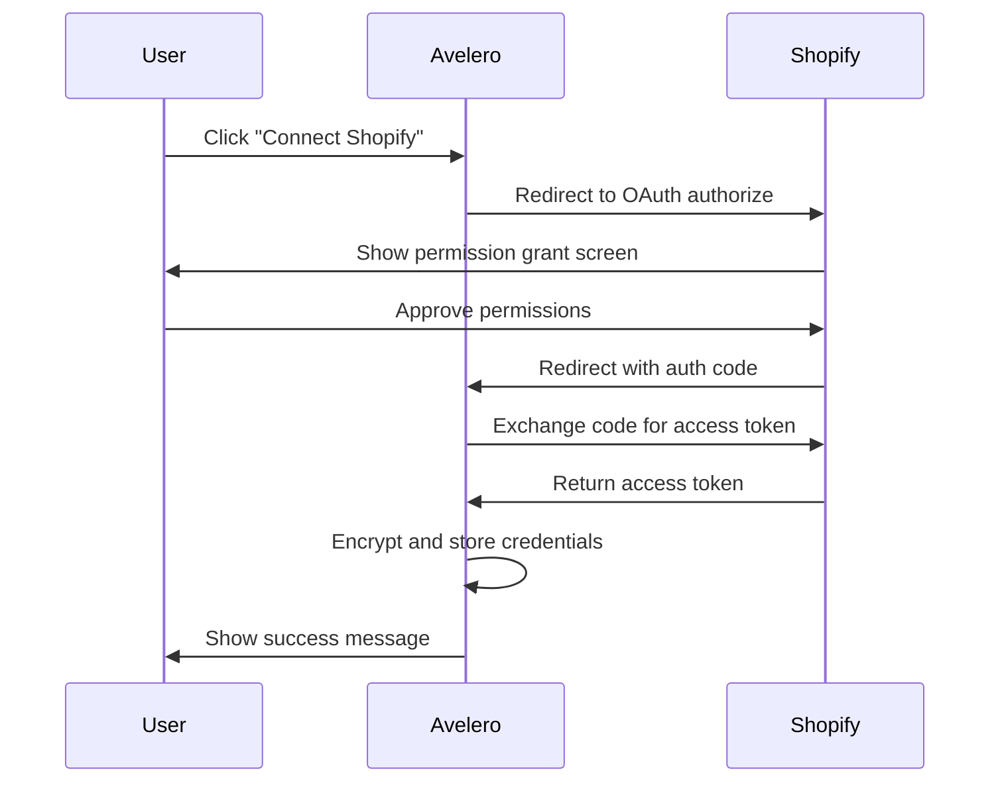

The Shopify integration connects your Shopify store to Avelero, automatically syncing products and variants to generate Digital Product Passports.

## Features

- **Two-way product sync**: Import products from Shopify with all variants, options, and metadata
- **Automatic updates**: Products stay in sync via scheduled syncs and webhooks
- **OAuth authentication**: Secure connection without sharing passwords
- **Field mapping**: Control which data comes from Shopify vs. manual entry in Avelero
- **Variant matching**: Match Shopify variants to existing Avelero products via SKU or barcode

## Installation

There are two ways to install the Shopify integration:

### Option A: Install from Avelero (recommended)

<Steps>
  <Step title="Navigate to integrations">
    Go to **Settings** → **Integrations** in your Avelero dashboard.
  </Step>
  
  <Step title="Connect Shopify">
    Click **Connect** on the Shopify card.
  </Step>
  
  <Step title="Authorize access">
    You'll be redirected to Shopify. Log in to your store and click **Install app**.
  </Step>
  
  <Step title="Return to Avelero">
    After authorization, you'll be redirected back to Avelero. Your integration is now active.
  </Step>
</Steps>

### Option B: Install from Shopify App Store

<Steps>
  <Step title="Find Avelero in Shopify App Store">
    Search for "Avelero" in the [Shopify App Store](https://apps.shopify.com).
  </Step>
  
  <Step title="Install the app">
    Click **Add app** and authorize the required permissions.
  </Step>
  
  <Step title="Claim installation in Avelero">
    Log in to Avelero and go to **Settings** → **Integrations** → **Shopify**. Click **Claim pending installation** to link the app to your brand.
  </Step>
</Steps>

<Note>
The Shopify integration requires the `read_products` permission to sync product data. No customer data is accessed or stored.
</Note>

## Authentication flow

The Shopify integration uses OAuth 2.0 for secure authentication:



**Technical details:**

- Authorization endpoint: `https://admin.shopify.com/oauth/install`
- Token exchange: `POST https://{shop}.myshopify.com/admin/oauth/access_token`
- Scopes: `read_products`
- Credentials are encrypted using AES-256-GCM before storage

## Syncing products

### Initial sync

When you first connect Shopify:

1. Click **Sync now** or wait for the automatic sync to start
2. Avelero fetches all products from Shopify's GraphQL Admin API
3. Products are created in Avelero with Shopify's product structure
4. Digital Product Passports are generated automatically

**What gets synced:**

<ResponseField name="Product fields" type="object">
  - `handle`: Product slug (used as unique identifier)
  - `title`: Product name
  - `description`: Product description (HTML)
  - `status`: Publication status (draft, active, archived)
  - `productType`: Product type/category
  - `vendor`: Manufacturer name
  - `tags`: Product tags (array)
  - `featuredImage`: Main product image URL
  - `category`: Shopify product category taxonomy
</ResponseField>

<ResponseField name="Variant fields" type="object">
  - `sku`: Stock keeping unit
  - `barcode`: Product barcode (UPC, EAN, etc.)
  - `title`: Variant name (e.g., "Small / Red")
  - `price`: Variant price
  - `selectedOptions`: Array of option values (size, color, etc.)
  - `image`: Variant-specific image URL
</ResponseField>

### Scheduled syncs

By default, Shopify syncs every **24 hours**. You can adjust this in integration settings:

- Minimum interval: **1 hour**
- Maximum interval: **7 days**
- Default: **24 hours**

### Manual sync

<Steps>
  <Step title="Open integration settings">
    Go to **Settings** → **Integrations** → **Shopify**.
  </Step>
  
  <Step title="Trigger sync">
    Click **Sync now**.
  </Step>
  
  <Step title="Monitor progress">
    The sync status updates in real-time. You can close the page - the sync continues in the background.
  </Step>
</Steps>

### Sync behavior

**Creating products:**
- New Shopify products are created in Avelero
- Product handle is used as the unique identifier
- All variants are imported

**Updating products:**
- Existing products (matched by handle) are updated
- Only fields owned by Shopify integration are updated
- Manual edits to non-owned fields are preserved

**Deleting products:**
- Products deleted in Shopify are NOT deleted in Avelero
- They remain in Avelero for historical/compliance purposes
- You can manually archive them if needed

## Webhooks

Shopify sends webhooks to Avelero for real-time updates:

### Mandatory compliance webhooks

These webhooks are required by Shopify and handle GDPR compliance:

<CodeGroup>
```http customers/data_request
POST https://api.avelero.com/integrations/webhooks/compliance
X-Shopify-Topic: customers/data_request
X-Shopify-Hmac-Sha256: {signature}

{
  "shop_domain": "example.myshopify.com",
  "customer": {
    "id": 123456789,
    "email": "customer@example.com"
  }
}
```

```http customers/redact
POST https://api.avelero.com/integrations/webhooks/compliance
X-Shopify-Topic: customers/redact
X-Shopify-Hmac-Sha256: {signature}

{
  "shop_domain": "example.myshopify.com",
  "customer": {
    "id": 123456789,
    "email": "customer@example.com"
  }
}
```

```http shop/redact
POST https://api.avelero.com/integrations/webhooks/compliance
X-Shopify-Topic: shop/redact
X-Shopify-Hmac-Sha256: {signature}

{
  "shop_id": 123456789,
  "shop_domain": "example.myshopify.com"
}
```
</CodeGroup>

**Webhook handling:**

- `customers/data_request`: No action (Avelero doesn't store customer data)
- `customers/redact`: No action (Avelero doesn't store customer data)
- `shop/redact`: Deletes brand integration record 48 hours after app uninstall

### Verifying webhooks

Avelero verifies all Shopify webhooks using HMAC-SHA256:

<CodeGroup>
```typescript Verification logic
import { createHmac } from 'crypto';

function verifyShopifyWebhook(
  rawBody: string,
  hmacHeader: string,
  secret: string
): boolean {
  const hash = createHmac('sha256', secret)
    .update(rawBody, 'utf8')
    .digest('base64');
  
  return hash === hmacHeader;
}
```

```typescript Usage example
const rawBody = await request.text();
const hmac = request.headers.get('X-Shopify-Hmac-Sha256');
const secret = process.env.SHOPIFY_CLIENT_SECRET;

if (!verifyShopifyWebhook(rawBody, hmac, secret)) {
  return new Response('Unauthorized', { status: 401 });
}

// Process webhook...
```
</CodeGroup>

## Field mapping

Configure which Shopify fields map to Avelero fields and control ownership:

<Steps>
  <Step title="Open field mapping">
    Go to **Settings** → **Integrations** → **Shopify** → **Field mapping**.
  </Step>
  
  <Step title="Review default mappings">
    Shopify fields are mapped to Avelero fields automatically:
    
    | Shopify field | Avelero field | Ownership |
    |---------------|---------------|------------|
    | `title` | Product name | Shopify |
    | `description` | Product description | Shopify |
    | `handle` | Product handle | Shopify |
    | `vendor` | Manufacturer | Shopify |
    | `productType` | Category | Shopify |
    | `tags` | Tags | Shopify |
    | `sku` | Variant SKU | Shopify |
    | `barcode` | Variant barcode | Shopify |
  </Step>
  
  <Step title="Customize ownership">
    Click **Edit** on any field to:
    - Enable/disable ownership
    - Choose alternative source options
    - View which integration currently owns the field
  </Step>
</Steps>

<Warning>
Disabling ownership for a field means manual edits in Avelero will be preserved, but that field won't be updated from Shopify during syncs.
</Warning>

## Variant matching (secondary integration)

If Shopify is connected as a **secondary integration** (not primary), variants are matched to existing products:

**Matching strategies:**

1. **By SKU** (default): Shopify variants are matched to Avelero variants with the same SKU
2. **By barcode**: Match using barcode instead (configure in integration settings)

**Match behavior:**
- If a match is found, the variant is enriched with Shopify data (based on field ownership)
- If no match is found, the variant is skipped (not created)
- Unmatched variants are logged in the sync report

## Troubleshooting

<AccordionGroup>
  <Accordion title="Connection fails with 'Invalid signature' error">
    **Cause:** OAuth flow was interrupted or tampered with.
    
    **Solution:**
    1. Disconnect the integration in Avelero
    2. Uninstall the Avelero app from Shopify admin
    3. Reconnect using the "Install from Avelero" flow
  </Accordion>

  <Accordion title="Sync shows 'Authentication failed' error">
    **Cause:** Shopify access token expired or was revoked.
    
    **Solution:**
    1. Go to Shopify admin → Apps
    2. Verify Avelero app is still installed
    3. If installed, disconnect and reconnect in Avelero
    4. If not installed, reinstall from Avelero
  </Accordion>

  <Accordion title="Products are syncing but images aren't appearing">
    **Cause:** Shopify image URLs are CDN links that may require authentication.
    
    **Solution:**
    - Images are referenced by URL, not downloaded
    - Verify image URLs are publicly accessible
    - Check that `featuredImage.url` exists in Shopify's GraphQL response
  </Accordion>

  <Accordion title="Some products are missing after sync">
    **Cause:** Products may be filtered by status or location.
    
    **Solution:**
    1. Check product status in Shopify (must be published)
    2. Verify products exist in the primary location
    3. Review sync job logs in **Settings** → **Integrations** → **Shopify** → **Sync history**
  </Accordion>

  <Accordion title="Variant options aren't syncing correctly">
    **Cause:** Shopify uses a different attribute structure than Avelero.
    
    **Solution:**
    - Shopify options (Size, Color) are synced as Avelero attributes
    - Option values become attribute values
    - Review attribute mappings in **Catalog** → **Attributes**
  </Accordion>
</AccordionGroup>

## API reference

### Shopify GraphQL queries

Avelero uses Shopify's GraphQL Admin API version **2025-07**:

<CodeGroup>
```graphql Products query
query GetProducts($first: Int!, $after: String) {
  products(first: $first, after: $after) {
    pageInfo {
      hasNextPage
      endCursor
    }
    edges {
      node {
        id
        handle
        title
        description
        descriptionHtml
        status
        productType
        vendor
        tags
        onlineStoreUrl
        featuredImage {
          url
        }
        category {
          id
          name
          fullName
        }
        variants(first: 100) {
          edges {
            node {
              id
              sku
              barcode
              title
              price
              selectedOptions {
                name
                value
              }
              image {
                url
              }
            }
          }
        }
      }
    }
  }
}
```

```graphql Shop query (connection test)
query {
  shop {
    name
    primaryDomain {
      url
    }
  }
}
```
</CodeGroup>

### Rate limiting

Shopify enforces GraphQL rate limits based on query cost:

- **Maximum available**: 2000 points
- **Restore rate**: 100 points/second
- **Product query cost**: ~50-150 points (depending on fields)

Avelero automatically throttles requests to stay within limits:

```typescript Rate limit handling
if (extensions?.cost?.throttleStatus) {
  const { currentlyAvailable, restoreRate } = extensions.cost.throttleStatus;
  
  if (currentlyAvailable < 100) {
    const deficit = 100 - currentlyAvailable;
    const delayMs = Math.ceil((deficit / restoreRate) * 1000);
    await new Promise(resolve => setTimeout(resolve, delayMs));
  }
}
```

## Next steps

<CardGroup cols={2}>
  <Card title="Bulk import/export" icon="file-excel" href="/integrations/bulk-import-export">
    Supplement Shopify data with bulk imports for supply chain and sustainability info.
  </Card>
  
  <Card title="Product data structure" icon="diagram-project" href="/guides/product-data-structure">
    Learn how product data is structured and inherited.
  </Card>
</CardGroup>
